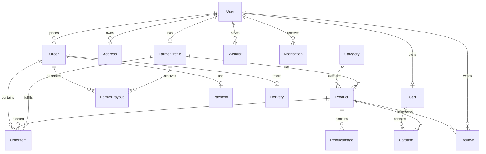

# FarmDirect Database Architecture

FarmDirect uses **Prisma ORM** with SQLite for instant local execution and 100% native compatibility with PostgreSQL for production environments.

---

## Entity Relationship Overview

---

## Key Models & Invariants

### 1. `User`
- `role`: `CONSUMER` | `FARMER` | `ADMIN`
- Enforces unique email lookup and bcrypt-hashed credentials.

### 2. `FarmerProfile`
- Tied 1-to-1 with a User record.
- Stores agricultural metadata (`farmName`, `location`, `farmingType`, `farmSize`, `experienceYears`, `verificationStatus`).

### 3. `Product`
- Linked to `FarmerProfile` and `Category`.
- `price`: Direct farm price per unit.
- `estimatedMarketPrice`: Traditional retail price for price transparency metrics.
- `availableQuantity`: Real-time stock tracked via database transactions.

### 4. `Order` & `OrderItem`
- `deliveryAddressSnapshot`: Immutable JSON snapshot preserving the exact shipping destination at the time of purchase.
- `subtotal`, `deliveryFee`, `platformFee` (5%), `total`.
- Atomic stock decrements executed via Prisma `$transaction`.

### 5. `FarmerPayout`
- Tracks gross sales per farmer, the 5% platform cut, and net farmer earnings to guarantee fair, auditable settlements.
